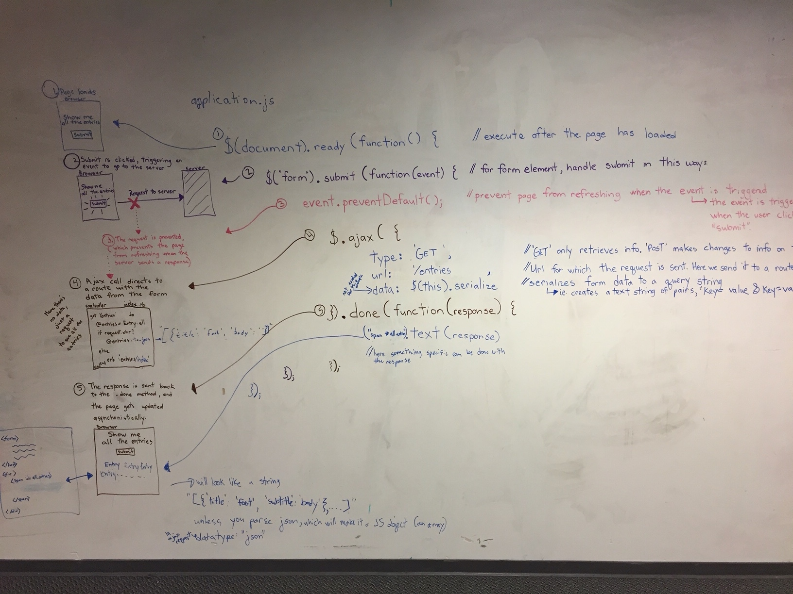

<h1>XHR (AJAX) Request</h1>

A description of how a typical XHR (AJAX) request works including the various systems involved, what they do, and how they interact. AJAX is an acronym for Asynchronous JavaScript and XML.

Technologies: AJAX, JavaScript, jQuery, JSON, Ruby, Rails.

<h3>From a Users perspective, explain an XHR (AJAX) request</h3>

When a User is on a webpage and clicks or scrolls, an XHR request prevents the whole web page from reloading and instead asynchronously updates parts of the web page. This enables other scripts to run at the same time, without the web page slowing down due to having to reload the entire page.
 

Examples of applications using XHR (AJAX) requests include Facebook, Gmail, Google Maps, and more!

A typical XHR request:

