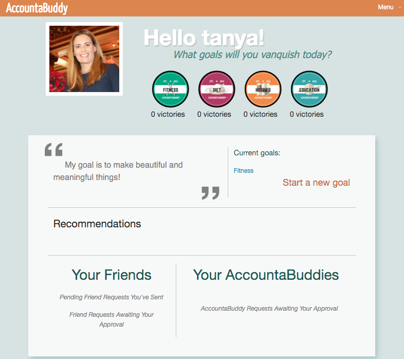
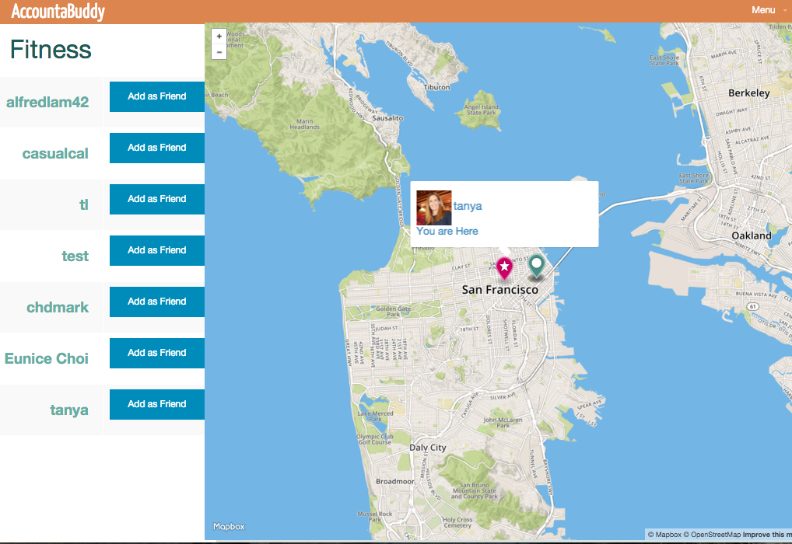

<h1>AccountaBuddy</h1>

Accountabuddy is a social media platform for people to connect through shared goals and location. Accountabuddy is a 1-week long capstone project. 

Technologies:  Ruby, JavaScript, AJAX, Ruby on Rails, MVC, PostgreSQL, HTML5, CSS, gems, Mapbox API, OAuth, Pair Programming.

AccountaBuddy Home Page

AccountaBuddy Profile Page

Accountabuddy Category and Map Page

