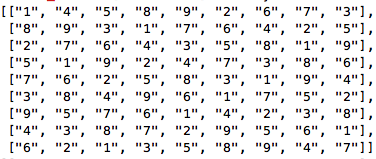

<h1>Sudoku Solver</h1>

<p>A Sudoku solver that can run from the command line given a string of numbers such as, "1-58-2----9--764-52--4--819-19--73-6762-83-9-----61-5---76---3-43--2-5-16--3-89--", will print the solution in the terminal. (See image below). The code first checks for solutions in the rows and columns, and then the 3x3 boxes.</p>

<p>My role: I built sudoku.rb</p>

<p>Sample string:</p>
  1 - 5 8 - 2 - - -
  - 9 - - 7 6 4 - 5
  2 - - 4 - - 8 1 9
  - 1 9 - - 7 3 - 6
  7 6 2 - 8 3 - 9 -
  - - - - 6 1 - 5 -
  - - 7 6 - - - 3 -
  4 3 - - 2 - 5 - 1
  6 - - 3 - 8 9 - -
  ```
<p>Actual solution:</p>
